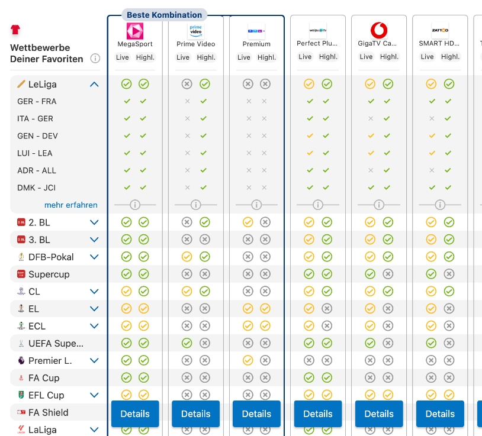

## Check24-Comparison-App

Finding the best streaming packages from Magenta Sports, Amazon Prime, or Sky to watch the favorite football team can be tricky with their extensive offerings. 

## Table of Contents
- [The Challenge 🤔](#the-challenge)
- [Minimum Requirements ✅](#minimum-requirements)
- [Example 🖥️](#example)
- [Data Processing 🧑🏼‍💻](#data-processing)

## The Challenge
Build an application that allows users to compare the best streaming packages for watching their favorite teams' matches. Users can select one or more teams and receive a comparison of streaming packages based on the availability of the selected teams' games. If one package doesn't stream every match, the next step is to compute the best combination of packages. The combination of packages should cover as many games as possible while finding the lowest total price. The focus should be on comparing the most packages / finding the best combination in the given time.

### Minimum Requirements
1. Team selection for one or multiple teams
2. Ranking of streaming packages based on availability of streamed matches
3. Offering the smallest price combination you can find if one package doesn't cover everything
4. Reasonable search time (make sure UX is not affected in a negative way)

There's always room for an improved feature set. Maybe it can make sense to book monthly packages one after another expires, instead of purchasing multiple yearly ones together. Improve, adapt, overcome.

More inspiration for additional features could be:

1. Search by teams, leagues, date ranges and more
2. Save past searches and recommend similar packages
3. Visualize the upcoming games and the availability on streaming services

### Example
A user wants to watch matches of their favorite teams and compares the best streaming packages for them. The result can look similar to this:

---

Some interesting queries, that we'll test:
- Bayern München (of course)
- Hatayspor, Deutschland, Bayern München and Real Madrid
- Minimum number of services for *all* games
- Oxford United, Los Angeles FC, AS Rom

### Data Processing
Performance is as always very important due to UX. The maximum duration has to be reasonable for the user facing part (UI showing the results), find the best combination possible in this time span - the more efficient, the better. Use whatever tech stack you prefer and feel free to implement your own algorithms, data structure, caching or pre-computation.

**Games**
Games are played by two teams on a given date in a tournament.

**Streaming Packages**
These packages are offered by companies like Magenta, Sky, etc. and have a monthly/yearly price. Your objective is to list these in your result overview.

**Streaming Offers**
An offer is from a streaming package for a specific game. It specifies the availability for live viewing or on demand highlights. Both availabilities should be included in the result comparison.
